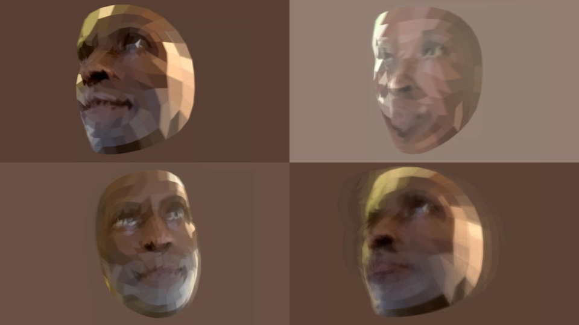
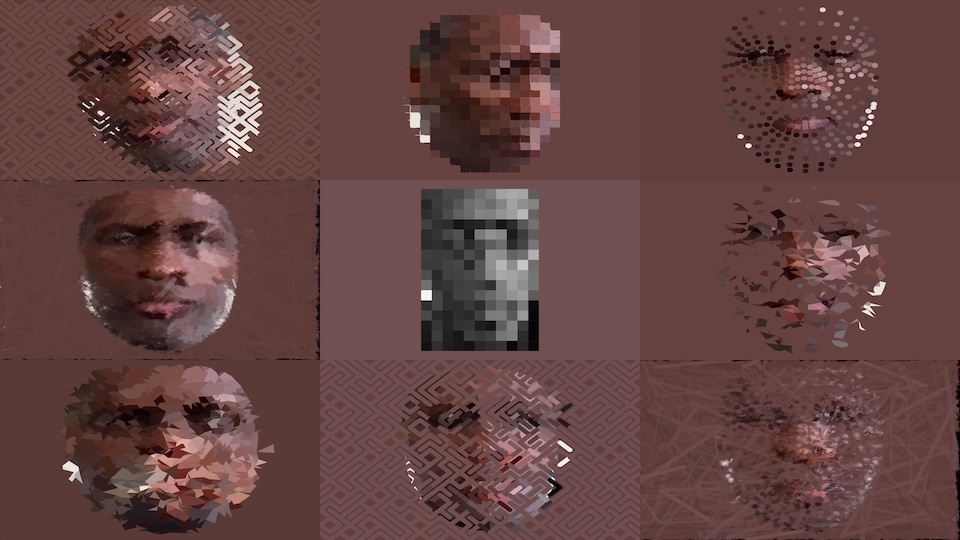
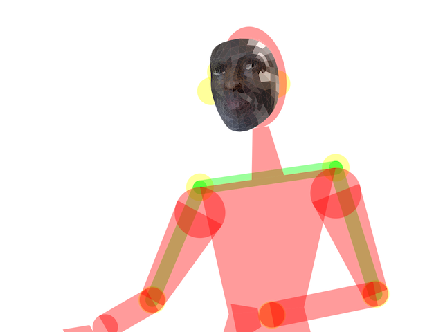

# p5VideoKit

p5VideoKit is dashboard for mixing video in the browser.
You can apply visual effects
to live video from a camera or from the internet.
The visual effects are written in p5js.

The code and documentation is in development.
We welcome your feedback and help to improve the user interface and documentation.

- started as code for interactive installation at NYU-ITP Brooklyn 2021
- built on top of effects using in DICE app and from ICM course
- contact me
- TODO: video walk thru

## Screen shots

Screen shots of p5VideoKit in action:

[Colored Portraits Installation @ 370 Jay St. Brooklyn 2021](https://jht1493.github.io/2021-NYU-ITP-Installation/colored.html)

## Demo

p5VideoKit runs best in modern desktop browsers. I've tested primarily in Google Chrome and second on Apple Safari on MacOS desktop computers. On mobile devices (iPhone and Android) things are flaky - landscape mode is best here.

[Grid demo](https://jht1493.net/p5VideoKit/demo/?d=demo/grid1.json) - a pixelized grid of video. Hit the Reset button if you don't see any video.

[4 effects demo](https://jht1493.net/p5VideoKit/demo/?d=demo/effects4.json) - four effects and be seen in a 2 by 2 layout. Use the Patch drop down to select an effect.

[live1](https://jht1493.net/p5VideoKit/demo/?d=demo/live1.json) - joint the VideoKit-Play-1 live streaming room.

[archive of settings ](https://jht1493.net/p5VideoKit/demo/settings.html) not every settings work

## The interface

- adding patches

## The code

- moving beyond the p5js web editor
- download this repo with [github disktop app](https://desktop.github.com/)
- run local server using
  [Visual Studio Code text editor](https://code.visualstudio.com/)
  with extensions:
  [p5.vscode+Live Server](https://marketplace.visualstudio.com/items?itemName=samplavigne.p5-vscode)

- running locally setup
- adding settings - export
- adding effect

## Live streaming

- Live Device check box enables live stream to all other instances using room.

## History

[p5VideoKit is based of the code used to create the interactive installation at NYU-ITP in 2021](https://jht1493.github.io/2021-NYU-ITP-Installation/)

[Keeping in the groove of my DICE video art app](http://www.johnhenrythompson.com/3-dice)

- **Distributed Instruments for Computed Expression**

## Components

Built using

- [p5js](https://p5js.org)
- [ml5js](https://ml5js.org)
- [p5LiveMedia](https://github.com/vanevery/p5LiveMedia)

